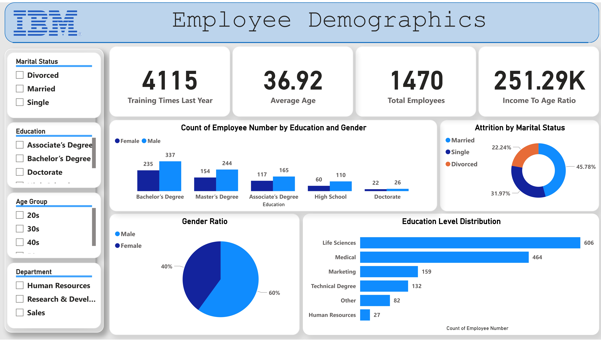

IBM HR Analytics Employee Attrition & Performance

Project Overview

This project explores employee attrition and performance data from IBM HR Analytics. The goal is to identify key factors affecting employee turnover and satisfaction using Python for data preprocessing and Power BI for visualization.

Summary

Total Employees: 1,470

Employees Who Left: 237 (16.1%)

Gender Ratio: Male (60%), Female (40%)

Attrition by Gender: Male (63.29%), Female (36.71%)

Marital Status: Married (45.78%), Single (31.97%), Divorced (22.24%)

Education Levels:

Bachelor's Degree: 337

Master's Degree: 244

Associate's Degree: 165

High School: 110

Doctorate: 26

Technologies Used

Python (Pandas, Matplotlib, Seaborn) for data analysis and cleaning

Power BI for visualization

Key Insights

Sales Executives & Research Scientists have the highest attrition rates.

Employees with poor work-life balance are more likely to leave.

Higher job levels correspond to better salaries, but salary alone doesn’t guarantee job satisfaction.

The average salary hike among employees was 22%.

Project Files

IBM HR.ipynb – Jupyter Notebook for data processing and analysis.

IBM.pdf – Report summarizing key insights.

Power BI Dashboard – Visual representation of findings.

Screenshots
1- 

2- 

3- 

